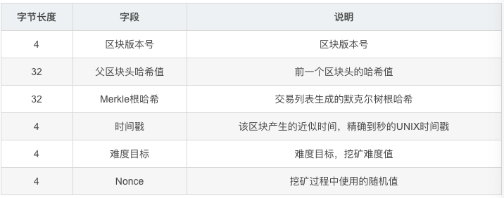
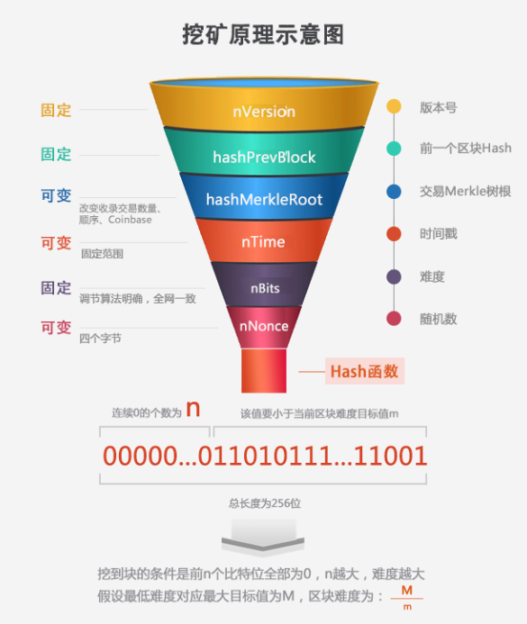

# BTC挖矿与难度调整

#### 1.比特币区块头包含以下数据：



#### 2.比特币挖矿流程如下：

1. 从交易内存池中选择要包含进区块的交易，区块大小不能超过1M，因此只能打包有限个交易，一般做法是根据交易手续费对交易排序后尽量容纳进最多的交易
2. 构造Coinbase交易，将出块奖励和手续费发送到矿工地址
3. 对所有交易构造Merkle树，计算Merkle树根Hash
4. 填充区块头字段
5. 对区块头进行两次Hash运算
6. 如果*sha256(sha256(block_header)) < current_target*，则区块符合要求，向全网广播此区块；若不满足要求，则对区块头某些字段进行修改后重新计算Hash，直到满足要求为止




#### 3.difficulty与target：

difficulty的计算：

​	**difficulty = difficulty_1_target / current_target**

需要注意的是，difficulty值并不保存在区块中，difficulty只是为了给人类一个对挖矿难度的直观感受，实际区块中存储的是编码过后的target值。

target是一个256位的数字，difficulty_1_target就是难度值为1时的target值，也是最大target值，这个时候挖矿最容易，因为很容易就能够得到一个小于此值的hash，比特币中这个值为：

```
0x00000000FFFF0000000000000000000000000000000000000000000000000000
```

为了节省空间，区块中保存的是编码为4字节的target值（bits字段），矿工计算出256位区块头hash后，与解码出来的256位target比较，如果小于target则是合法区块。

比如，表示难度为1的target值编码为：*0x1d00ffff*，第一个字节为指数，后三个字节为底，解码过程为：

```
0x00ffff * 2**(8*(0x1d - 3)) = 0x00000000FFFF0000000000000000000000000000000000000000000000000000
```


#### 4.难度调节：

上面说到了，难度值只是为了让人们对挖矿难度有一个直观感受而计算出来的值，实际区块中不保存此值，因此难度调节其实不是调节难度值，调节的是保存在区块中的target值，也就是区块头的bits字段，这个过程叫做retarget

比特币的retarget每2016个块进行一次，理想状态下，比特币出块时间为10分钟，进行retarget就是为了维持10分钟一个块的出块速度，因此比特币根据如下公式来调节target值：

**new_target = old_target * (actual_time_of_last_2016_blocks / 20160 minutes)**

根据上一个周期（2016块）的出块时间来调整target，如果上一个周期出块过快，小于20160分钟，则新target值会变小，那么找到小于这个新target值的区块头hash值就更困难，花费的时间也就越长，新周期的出块时间就会向10min靠拢；上一个周期出块过慢则新target变大，出块速度会提高，同样向10min一块靠拢

Note:我们平常所说的选择“最长链”作为主链其实并不准确，准确说法是选择“累计难度最大链”作为主链

#### 5.不足

1. 针对SHA256的ASIC矿机的出现会导致算力的集中

2. 每隔2016块才进行一次难度调节 ，可能会导致链的“猝死”，详见[此处](https://weibo.com/ttarticle/p/show?id=2309404311774605218368)


Ref:

​	0.https://en.bitcoin.it/wiki/Difficulty

​	1.http://8btc.com/article-4759-1.html

​	2.https://blog.csdn.net/u013137970/article/details/69891985

​	3.https://blog.csdn.net/taifei/article/details/72895903

​	4.http://www.aquagemini.com/bitcoin-difficulty-adjust/

​	5.https://weibo.com/ttarticle/p/show?id=2309404311774605218368

