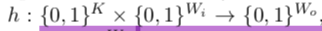
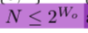
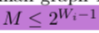
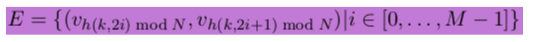
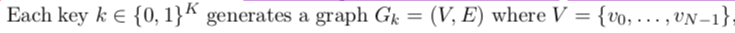
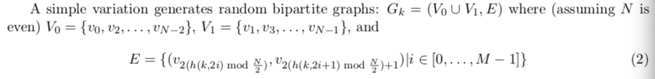
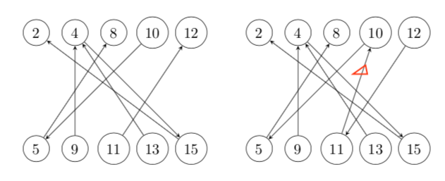
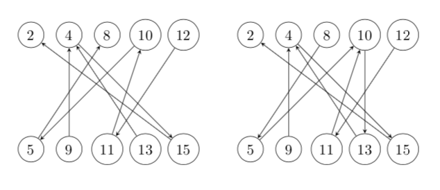
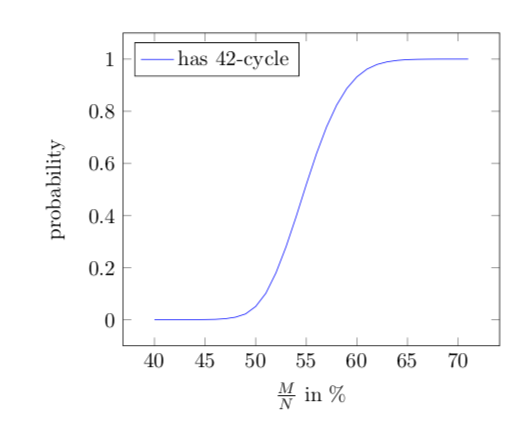
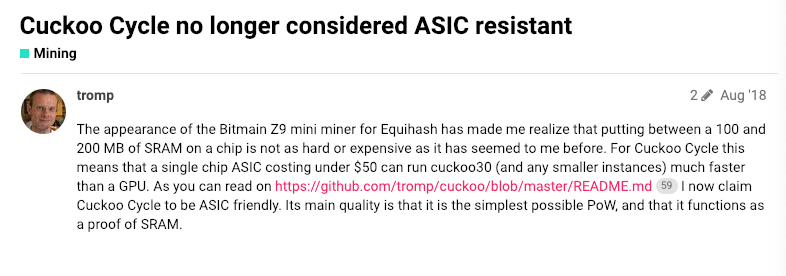

# Cuckoo Cycle

## 1.Basic idea

​	Cuckoo Cycle 的作者是 John Tromp，该算法论文于2014年12月31日发表。由于一般ASIC的优势在于计算，所以Cuckoo Cycle的基本思想是让内存访问的时间远大于计算的时间，让需要的内存空间较大，超出一般SRAM的大小，而能够被较慢的DRAM容纳，SRAM比DRAM快一个数量级，而却比DRAM贵两个数量级，所以为加速内存访问而去为ASIC搭载SRAM是不划算的，以此来实现ASIC Resistant。

​	Cuckoo Cycle和比特币的PoW不一样，比特币PoW是寻找小于target的Hash值，Cuckoo Cycle是基于图论的算法，要解决的问题是在一张图中寻找特定的环形结构。

## 2.算法介绍

1. 定义keyed hash function h和N，M

   

   

   

   每个key K可以按照如下公式生成一张N个顶点，M条边的图：

   

​	

​	其中i也被称为nonce，如果图H作为子图出现在这张图中，则称这张图有解，假设H包含L条边，要验证这张图是否有解，只需要提供L个nonce就行了，根据L个nonce按照上述公式生成L条边，如果L条边构成了图H，则证明这张图有解

2. 稍微将上面生成边E的公式变形一下：

   

   这样就得到了一个二部图，奇数下标的顶点集合为V0，偶数为V1，生成的边的两个顶点分别落在两个集合里，Cuckoo Cycle就是要在这样一个二部图中寻找环形结构，即H是一个L条边的Cycle，Cuckoo Cycle中使用的Hash function h是siphash，K = 128， Wi, W0长度均为64位，因此，图的顶点数N <= 2^64，取M = N / 2

3. Cuckoo Cycle中的Cuckoo来自于Cuckoo Hash，Cuckoo Hash是一种解决Hash表冲突的方法，详细介绍请看[这里](https://www.cnblogs.com/bonelee/p/6409733.html)。

   我们枚举M个nonce，向图中插入边，边是有向边，从被占据的bucket指向二部图另一边可选的bucket（需要了解Cuckoo Hash原理），比如现在nonce 4被hash到了顶点10、11的位置，但10现在已被占据，11还是空的，所以新元素会被放在11的位置，在这里就是加入了一条从11指向10的边

   

   如果插入元素的过程中某个位置的元素被踢出去了，那就将被踢出去的元素放到箭头指向的位置，然后将箭头反向就好了，如果箭头指向的位置被占，直接将其踢出去，如此往复，直到所有元素都找到位置或者达到了设置的轮次阈值。如果图中出现了环，那一定会达到这个阈值。现在加入边（10->13），10位置的元素被踢出去放到5位置，5位置的元素被踢出去放到8位置，同时路径上的箭头反向，然后加上10到13的箭头，得到右边的图：

   

4. 从上面的操作可以看出来，在插入一条边时，从边的两个顶点分别得到两个path，如插入（10->13）时，得到两个path:10->5->8, 13->4->15->2，前一个path较短，说明需要调整的次数较少，故选择将新元素放在10位置并将第一个path反向。在插入边时，每次找出两个path，如果两个path的最后一个元素（root）相同，那插入新边就会造成一个环，比如在上边右边图上继续插入(8->9)，得到path：8->5->10->13->4->15->2和9->4->15->2，两个path的root相同，那么插入8->9就会造成一个环了，这样就可以通过判断两个path的root来判断环是否存在。环的长度则是1加上两条path汇合的长度，比如这里两条path在4位置汇合，那么环的长度就是1 + 4 + 1 = 6。

​	以上就是Cuckoo Cycle的核心问题，Cuckoo Cycle的难度调整可以通过调整M,N的值和目标Cycle的边长L来实现。下面这张图展示的是M/N的值和图中存在边长为42的cycle的概率关系：

## 3.总结

​	Cuckoo Cycle基于图论来设计PoW算法，非常新颖，作者初衷是将Cuckoo Cycle设计成ASIC Unfriendly的算法，在之后的一段时间内也达到了这个效果，但是比特大陆Z9矿机（针对CryptoNight算法，该算法也是memory hard）发布之后，作者在[GitHub](https://github.com/tromp/cuckoo)项目README中将ASIC Unfriendly改成了ASIC Friendly，因为Z9的推出说明比特大陆已经能够以较低成本在ASIC上搭载高速内存，作者最初的假设也不成立了。

### Ref:

​	1.https://forum.aeternity.com/t/cuckoo-cycle-no-longer-considered-asic-resistant/814

​	2.https://eprint.iacr.org/2014/059.pdf

​	3.https://blog.csdn.net/mayikeji/article/details/83958737

​	4.https://www.cnblogs.com/bonelee/p/6409733.html