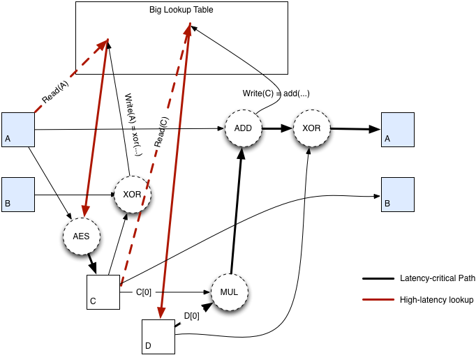

# Monero挖矿与难度调整

## 1. PoW(CryptoNight)

首先澄清一下两个概念：

1. CryptoNote: 一种加密货币协议，门罗币基于CryptoNote协议开发
2. CryptoNight: CryptoNote的PoW里面使用的Hash函数的名字

门罗币PoW使用的hash函数是CryptoNight，号称ASIC resistant，但比特大陆在2017年底还是研发出了针对CryptoNight的ASIC矿机，门罗社区为了抵抗ASIC，在2018.4.6进行了一次硬分叉，这次分叉一共分出5个币种（XMR, XMO, ZMR, XMC, XMV），除了主流的XMR，其他基本上都半死不活；

### CryptoNight

CryptoNight是一个memory-hard的哈希函数，即运算过程中需要大量内存，因此对一般的ASIC不友好，即ASIC resistant。CryptoNight运算步骤大致分为如下五步：

1. 将输入数据（区块头数据）使用Keccak算法处理后，拆分成A, B, C, D四部分

   ```
   Keccak(block_header) -> A|B|C|D
   ```

2. 处理A、C部分，将结果E放入暂存器（scratchpad，2M）

   ```
   A + C -> E
   ```

3. 先处理A、B得到AA、 BB，然后处理AA，BB和E，得到结果EE，放入暂存器

   ```
   A + B -> AA, BB
   AA + BB + E -> EE
   ```

4. 处理B、C和EE，得到结果CC，用CC替换掉C

   ```
   B + C + EE -> CC
   ```

5. 选择Hash函数对A、B、CC、D进行Hash，得到最终结果F

   ```
   Hash(A + B + CC + D) -> F
   ```

详细计算过程可参考[这里](https://cryptonote.org/cns/cns008.txt)




## 2. 难度调整

门罗基本参数：

* 出块时间：120s
* 出块奖励：前100个块出块奖励的的中位数，整体呈减少趋势

* 难度调整：基于前720个区块，逐块调整
* 块大小：动态调整，上限2*M100（前100个块大小中位数的2倍）

为了维持120s的出块速度，门罗币每个区块都会进行难度调整，具体规则如下：

1. 从当前块往前数15块开始，取720个块的出块时间
2. 去除720个块中出块最快和最慢的各60块，剩下600个块
3. 取剩下600个块出块时间的平均值
4. 根据计算出来的平均值，与标准出块时间120秒对照，调整出块难度，详见[比特币难度调整](./btc.md)


## 3.总结

采用需要大量内存的CryptoNight哈希函数从一定程度上来讲起到了抗ASIC的作用，因为涉及此类ASIC矿机的难度更大，成本更高，但并不是不可能。随着门罗币价格的上涨，研发此类矿机变得有利可图，所以比特大陆就研发出了针对CryptoNight的矿机。从技术上来讲，任何公开的算法都可以设计相应的ASIC加速计算芯片，只不过难易、成本不同，当币价上涨，设计这类矿机有利可图的时候，相应的矿机自然就出来了。

门罗币的难度调整和比特币最大的不同应该是逐块调整这一点，比特币每2016个块调整一次，门罗每个块都调整一次，难度曲线更加平滑，不会出现算力大幅波动（硬分叉除外），甚至”[猝死](https://weibo.com/ttarticle/p/show?id=2309404311774605218368)“现象。


### Ref :

​	1.https://zhuanlan.zhihu.com/p/34441197

​	2.https://zhuanlan.zhihu.com/p/34602965

​	3.https://monero.stackexchange.com/questions/7975/how-does-the-difficulty-adjustment-for-monero-work

​	4.https://hackernoon.com/asic-resistance-is-nothing-but-a-blockchain-buzzword-b91d3d770366

​	5.https://weibo.com/ttarticle/p/show?id=2309404311774605218368