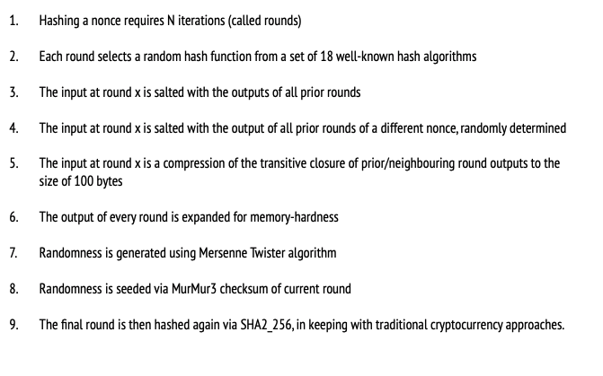
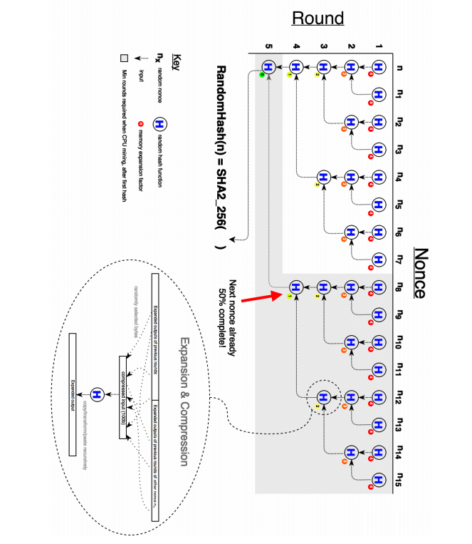
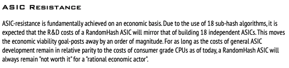

# Pascal Random Hash

​	所谓Random Hash就是随机选取Hash算法进行Hash，Pascal Coin选择了18种Hash算法，对一个nonce进行hash需要进行N轮hash，每次hash随机选择18种算法中的一种

白皮书中有一张流程图：

可以看到其中有很多步骤都依赖其他步骤的输出结果，这样做是为了提高并行的难度，抵制GPU

关于ASIC Resistance，白皮书中也是从经济层面解释的，为每种hash函数都研发对应的ASIC成本很高，所以矿机厂商不会去做这样的矿机

关于算法的详细信息，可查看[白皮书](https://www.pascalcoin.org/storage/whitepapers/RandomHash_Whitepaper.pdf)

目前来看，大多宣称ASIC Resistant的算法都是假定为自己的算法研发相应的ASIC成本高于收益，所以矿机厂商不会去做这种傻事，但是其实这种假设其实并不靠谱，如果币价一直趴着不起来，矿机厂商当然不会去做你的矿机，但如果你是一个有理想的币，想要像BTC、ETH一样百倍千倍，那就得做好ASIC矿机出现的准备，从经济层面实现ASIC Resistance，我想终究只能是缓兵之计。